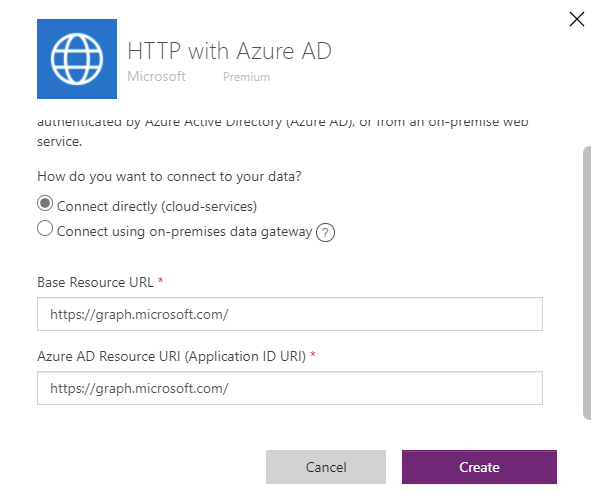
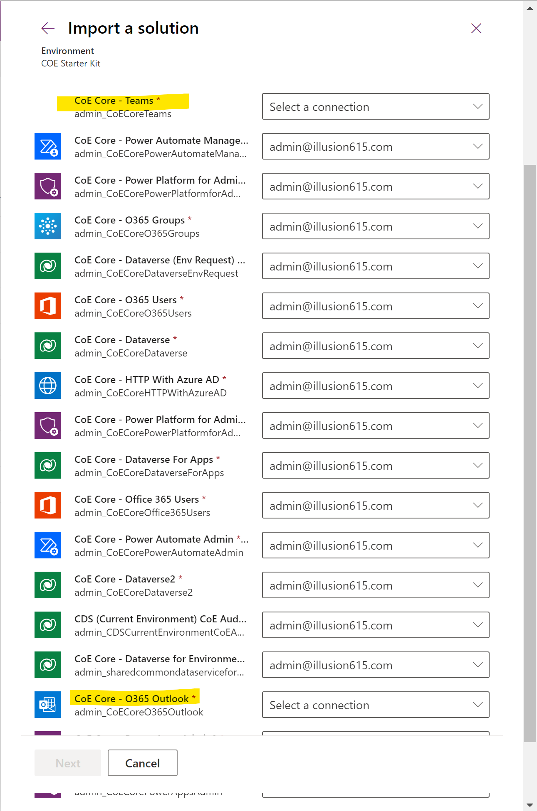
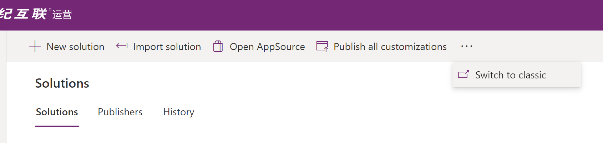
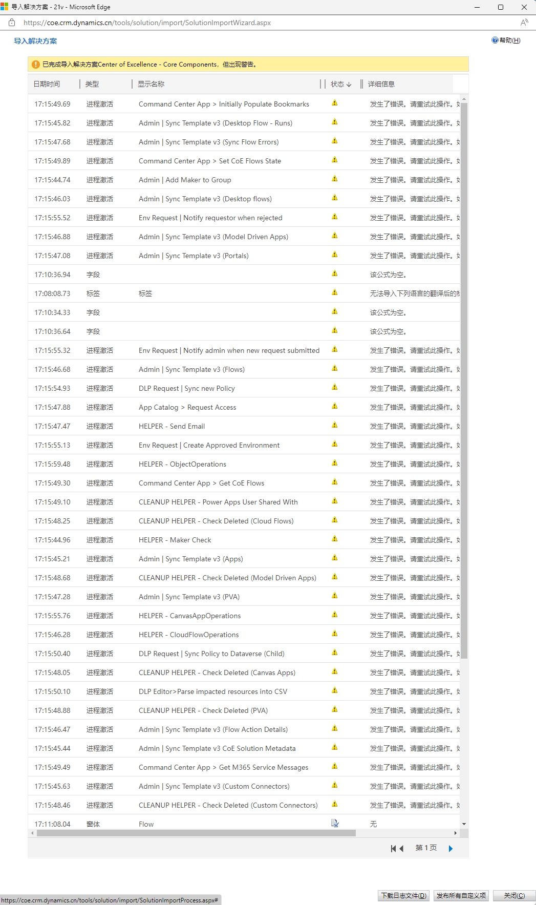

# Power Platform CoE Starter Kit在21v的部署备注
## 概要
该部署备注意在为使用Power Platform 21v的企业客户提供部署所需的参考，也可以认为是如何部署一个最小要求的CoE Starter Kit的部署参考。
## 前提
本安装部署备注基于如下假设且仅当如下假设满足时才成立：
1. 部署目标地为21v的Power Platform环境
2. 在21v没有Office 365或缺乏如下组件：
   * Outlook
   * Teams
3. 至少具备如下产品许可
   * Power Apps Per User许可
   * Power Automate Per User或Per Flow许可
   * Power BI许可（可选，非部署必须。只针对需要看Power BI报表的用户）
4. 具备如下权限之一
   * Microsoft Power Platform Service Admin
   * Tenant Admin
   * 或Dynamics 365 Service Admin
5. 校验DLP策略是否允许如下连接器被**同时**使用
   * Approvals
   * HTTP
   * HTTP with Azure AD
   * Microsoft Dataverse
   * Microsoft Dataverse (legacy)
   * Microsoft Teams **
   * Office 365 Groups
   * Microsoft Outlook **
   * Office 365 Users
   * Power Apps for Admins
   * Power Apps for Makers
   * Power Automate for Admins
   * Power Automate Management
   * Power Platform for Admins
   * RSS
   * SharePoint

> ** 相较Global版本的Starter Kit，因为很多MNC的客户在21v并未购买Microsoft 365，因此Teams和Outlook可能并不存在。对于此种情况，后续我们会手工将该连接器移除。因此也无需在DLP中考虑。

## 安装步骤
### 1. 下载安装部署包
访问位于Github的CoE项目地址网址下载[最新的release版本](https://github.com/microsoft/coe-starter-kit/releases)
因为后面需要对该版本做一些变更，请选择CoEStarterKit-Unmanaged.zip，即非托管版本。

### 2. 解压
在本地解压，里面会有很多文件，注意，这些文件需要按照特定的次序安装。具体可以参见[安装文档](https://docs.microsoft.com/en-us/power-platform/guidance/coe/setup)
此处对这些安装包各自的功能及安装依赖做一个的概要说明
| 文件名                                                      | 功能描述                                                                                                                                                                             | 依赖及安装建议                                                                                                       |           适用于21v           |
| ----------------------------------------------------------- | ------------------------------------------------------------------------------------------------------------------------------------------------------------------------------------ | -------------------------------------------------------------------------------------------------------------------- | :---------------------------: |
| CenterofExcellenceCoreComponents_x.xx_managed.zip           | 核心组件(部署到Dataverse生产环境)，包括：Admin - Command Center, DLP Editor v2, Set App/Flow Permissions, Power Platform Admin View, Environment Requests and admin app, App Catalog | 第一个需要安装的组件                                                                                                 |              Yes              |
| CenterofExcellenceCoreComponentsTeams_x.xx_managed.zip      | 内容同上，核心组件，区别在于该组件针对需要将CoE部署到Teams环境的需求。                                                                                                               | 如果选择将CoE部署到Teams里面的Dataverse，则该组件是第一个需要部署的组件。由于该指南针对21v，所以该组件当前并不适用。 |              No               |
| CenterofExcellenceAuditComponents_x.xx_managed.zip          | 包含低代码平台治理所需的工具，包括：Developer Compliance Center, Power Apps/Flow/Custom Connector/Chatbot Approval BPF, Teams governance*, Cleanup Old Objects App                   | Core components必须先行安装，                                                                                        | Teams governance在21v并不适用 |
| CenterofExcellenceAuditLogs_x.xx_managed.zip                | 包含审计日志所需的工具                                                                                                                                                               | Core components必须先行安装                                                                                          |              Yes              |
| CenterofExcellenceNurtureComponents_x.xx_managed.zip        | 包含低代码社区培育所需的工具(Training in a Day – Management/Registration, Maker Assessment and Admin App, Pulse survey components*, Template Catalog)                                | Core components必须先行安装，                                                                                        |    Pulse Survey在21v不适用    |
| ALMAcceleratorForMakers_x.x.yyyymmdd.x_managed.zip          | 包含面向低代码开发人员所需的应用生命周期管理工具                                                                                                                                     | 可独立部署                                                                                                           |              Yes              |
| CenterofExcellenceALMAccelerator_x.x.yyyymmdd.x_managed.zip | 包含面向低代码开发平台管理人员所需的应用生命周期管理工具                                                                                                                             | 可独立部署                                                                                                           |              Yes              |
| CenterofExcellenceInnovationBacklog_x.xx_managed.zip        | 包含供app想法收集及管理所需的工具，包括：Innovation Backlog and Admin app                                                                                                            | 可独立部署                                                                                                           |              Yes              |
| ToolIcons.zip                                               | CenterofExcellenceInnovationBacklog所需的图标库                                                                                                                                      | 可独立使用，无需安装                                                                                                 |              Yes              |
| MakerAssessmentStarterData.xlsx                             | 低代码开发者应用评估模板，企业可以以此为模板来撰写适合自身管理需求的问卷                                                                                                             | 可独立使用，无需安装                                                                                                 |              Yes              |
| Production_CoEDashboard_MMM2022.pbit                        | CoE Dashboard Power BI模板文件(部署到Dataverse生产环境)                                                                                                                              | 需要有21v的Power BI许可                                                                                              |              Yes              |
| Pulse_CoEDashboard.pbit                                     | Pulse survey Power BI template file.                                                                                                                                                 | 需要有21v的Power BI许可                                                                                              |              No               |
| Teams_CoEDashboard_MMM2022.pbit                             | CoE Dashboard Power BI模板文件(部署到Teams环境)                                                                                                                                      | 此模板针对CoE for Teams的部署类型，所以如果不准备将CoE部署到Teams Dataverse环境则不是必须的。                        |              No               |
| Theming_x.xx_managed.zip                                    | 主题管理组件                                                                                                                                                                         | 可以独立安装，与其他组件无依赖                                                                                       |              Yes              |

### 3. 准备环境
强烈建议用一个专用环境来部署CoE Starter Kit，不用担心这样会无法访问其他环节，因为后续Kit会通过一系列Admin连接器去所有环境同步所需信息。
### 4. 部署CenterofExcellenceCoreComponents_x.xx_managed.zip
在make.powerapps.cn中进入所准备的环境，在solution中导入。
在初始化数据连接器时注意如下几个连接器的设置

- HTTP with Azure AD，21v对应地址可以在[此处](https://docs.microsoft.com/en-us/graph/deployments#microsoft-graph-and-graph-explorer-service-root-endpoints)查询。
  此处给出Graph地址：https://microsoftgraph.chinacloudapi.cn
  

最后应该只有两个连接器无法配置

此时因为这两个连接器无法初始化，在make.powerapps.cn是无法进入到下一步的。因此需要取消，再如下图切换到经典模式完成方案的导入。在经典模式下缺失数据连接器初始化并不阻碍解决方案的导入。这个过程可能会需要十几分钟才会结束，此处可以有杯咖啡。

导入完成后注意检查状态，会发现大部分错误是由于无法完成进程激活，这些在后面都会通过检查来手动激活。

### 5. 完成环境变量的设置
部署完相关的solution包后，会出现若干预设的环境变量，其中部分是需要在初期完成设置才能完成后面Flow的成功激活。这些需要预设的环境变量如下：
| Name                                     | Description                                                                                                                                                                                                      | Value                                            |
| ---------------------------------------- | ---------------------------------------------------------------------------------------------------------------------------------------------------------------------------------------------------------------- | ------------------------------------------------ |
| Admin eMail                              | CoE管理员邮件地址                                                                                                                                                                                                |
| Individual Admin                         | This is the email address to which communications in the starter kit will be sent which cannot be sent to a group. More information: How will you communicate with your admins, makers, and users?               |
| Power Platform Maker Microsoft 365 Group | 在Microsoft 365为所有Power Platform makers创建一个group，并将其ID放在这里。该Group ID可以在Azure admin center的User and Group界面中找到 | 
| Graph URL Environment Variable           | The URL used to connect to Microsoft Graph.                                                                                                                                                                      | https://microsoftgraph.chinacloudapi.cn          |
| PowerApp Maker environment variable      | The URL used byA the Power Apps maker portal for your cloud, including the trailing slash.                                                                                                                       | https://make.powerapps.cn/                       |
| PowerApp Player environment variable     | The URL used by the Power Apps player for your cloud, including the trailing slash.                                                                                                                              | https://app.powerapps.cn                         |
| Power Automate Environment variable      | The URL used for Power Automate                                                                                                                                                                                  | https://www.powerautomate.cn/manage/environments/                  |
| TenantID                                 | 该ID可以在make.powerapps.cn的setting菜单下的Session Detail里面找到                                                                                                                                                                                            |

其余变量可以在需要的时候再进行设置。

### 6. 修改Flow以匹配21v依赖
由于MNC客户极大可能使用的是Global Microsoft 365套件，基于这种情况在21v将没有对应的Outlook可用，至于Teams，由于尚未在21v落地，因此不管客户是否有21v版本的Office 365，Teams连接器都将不可用。在之前的议题中我有给出一个整合21v Power Platform和Global Office 365用于发送邮件及审批的示例解决方案。在这里，我将以此为基础演示如何修改CoE Start Kit中对Outlook和Teams的依赖。

> 此修改依赖于之前议题所提及的21v GLobal M365集成方案，因此需要先部署该方案。

此处以Helper - Send Email为例演示如何将Outlook替换为邮件相关替代方案。其余Flow的操作与此类似。

#### 6.1 示例
打开HELPER - Send Email Flow后会发现如下错误

在这里给出原本这里会使用邮件发送消息的相关参数供参考

例如下图所示，我使用替代方案来实现邮件通知。

#### 6.2 需修改Flow列表
以下给出所有需要修改的Flow列表
- Helper - Send Email (含Outlook连接器)
- DLP Editor > Parse impacted resources into CSV (含Outlook连接器)
- App Catalog > Request Access (含Teams连接器)

### 7. 依次激活Core Component相关Flow
>几乎所有的FLow直接Turn On都会发生错误，因此都需要编辑、保存、再打开。错误一般都是因为如下两类原因。此工作比较枯燥无味，但又是CoE Starter Kit可以运行起来的必须工作。
> - 数据连接没有初始化：通过修改打开该Flow，初始化所需连接器，然后保存并Turn On该Flow一般都可以解决此类问题。
> - 环境变量未设置：有些Flow会依赖于环境变量，请仔细阅读错误信息，并更新对应的环境变量。

**子流程**

1. HELPER – Send Email（该流程需要先移除outlook连接器并使用其他通知替代方案）
2. HELPER – Maker Check
3. HELPER – CloudFlowOperations
4. HELPER – CanvasAppOperations
5. HELPER – ObjectOperations
6. CLEANUP HELPER – Check Deleted (Canvas Apps)
7. CLEANUP HELPER – Check Deleted (Cloud Flows)
8. CLEANUP HELPER – Check Deleted (Custom Connectors)
9. CLEANUP HELPER – Check Deleted (Model Driven Apps)
10. CLEANUP HELPER – Check Deleted (PVA) *
>*虽然PVA当前还未在21v落地，但该Flow会被后续的CLEANUP - Admin工作流调用，因此还是需要启用
11. CLEANUP HELPER – Power Apps User Shared With

**安装所需的Flow**

- Admin | Add Maker to Group
- Admin | Excuse Support Envts from Governance Flows
- Admin | Sync Template v3 Configure Emails
- Command Center App > Get M365 Service Messages
- Command Center App > Initially Populate Bookmarks
- Command Center App > Get CoE Flows
- Command Center App > Set CoE Flows State
- DLP Editor > Parse impacted resources into CSV
>该Flow可能会因为无法移除Outlook连接器而无法启用，暂无低成本的解决方案。替代方案可以在另外一套global环境中部署CoE并导出一个修改后的flow，但该方案成本较高。
- Admin | Sync Template v3 (Connectors)
- Admin | Sync Template v3 CoE Solution Metadata

**Inventory Flow**
> 由于Sync Flow会设置不同的延时，该延时可能长达数小时，因此不一定能马上看到整合的数据，

- Admin | Sync Template v3 (Apps)
- Admin | Sync Template v3 (Connection Identities)
- Admin | Sync Template v3 (Custom Connectors)
- Admin | Sync Template v3 (Desktop Flow - Runs)
- Admin | Sync Template v3 (Desktop flows)
- (optional) Admin | Sync Template v3 (Flow Action Details)
- Admin | Sync Template v3 (Flows)
- Admin | Sync Template v3 (Model Driven Apps)
- Admin | Sync Template v3 (Portals)
- Admin | Sync Template v3 (PVA)
>因为PVA当前还未在21v落地，因此该Flow可以忽略
- Admin | Sync Template v3 (Sync Flow Errors)
- Admin | Sync Template v3
- CLEANUP - Admin | Sync Template v3 (Check Deleted)
- CLEANUP - Admin | Sync Template v3 (Connection Status)
- CLEANUP - Admin | Sync Template v3 (Delete Bad Data)
- CLEANUP - Admin | Sync Template v3 (Orphaned Makers)
- CLEANUP - Admin | Sync Template v3 (Power Apps User Shared With)

### 8. 设置Environment请求相关组件
> 这一步需要先更新Update environment variables的值，请填入Admin - Environment Request Canvas App的Url

要让相关组件正常运行，需要启用如下Flow
- DLP Request | Apply Policy to Environment (Child)
- DLP Request | Sync Policy to Dataverse (Child)
- DLP Request | Process Approved Policy Change
> 可能发生的错误：Request to XRM API failed with error: 'Message: Flow client error returned with status code "BadRequest" and details "{"error":{"code":"ChildFlowUnsupportedForInvokerConnections","message":"ID 为“309dccc8-a76b-ec11-8943-00224828fb29”、名称为 DLP Request | Apply Policy to Environment (Child) 的工作流不能用作子工作流，因为子工作流仅支持嵌入的连接。"}}". Code: 0x80060467 InnerError: '.
解决方法：这是因为子工作流选择了用传入的身份调用连接，此处需要在子工作流Run only users设置处将Connection Used从Provided by run-only user设置为特定的连接，此设置需要将工作流重启才能生效。设置界面如下图所示（该图仅标注需要修改的位置，Provided by run-only user是错误的值，需要改为特定连接。）：

- DLP Request | Sync new Policy
- DLP Request | Sync Shared Policies
- Env Request | Cleanup environments
- Env Request | Create approved environment
- Env Request | Notify admin when new request submitted
- Env Request | Notify requestor when rejected

### 9.设置其他核心组件
激活如下Flow
- Admin | Capacity Alerts
- Admin | Welcome Email v3
> 需要依赖环境变量CommunityURL，可以考虑部署一个Power Portal并将其Url放入。
- App Catalog > Request Access
>需要移除Teams连接器并用替代方案取代。
原Flow的配置截图供参考

### 10. 共享App
需要将如下App共享给不同角色的用户，并赋予正确的安全角色
|App|用户类型|相关安全角色|
|-|-|-|
|Admin - Command Center|低代码平台管理员|Power Platform Admin SR|
|DLP Editor v2|低代码平台管理员|Power Platform Admin SR|
|Power Platform Admin View|低代码平台管理员|Power Platform Admin SR|
|Set App Permissions|低代码平台管理员|Power Platform Admin SR|
|Set Flow Permissions|低代码平台管理员|Power Platform Admin SR|
|Admin - Environment Request|低代码平台管理员|Power Platform Admin SR|
|Environment Request|低代码开发人员|Power Platform Maker SR|
|Maker - Command Center|低代码开发人员|Power Platform Maker SR|
|App Catalog|用户|Power Platform User SR|

### 11. Enjoy the CoE Starter Kit
有关CoE Starter Kit的详细使用方法请参阅 https://docs.microsoft.com/en-us/power-platform/guidance/coe/starter-kit-explained