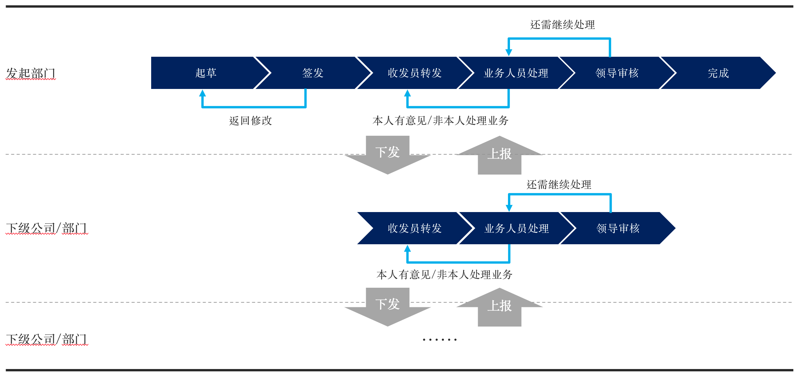

# 商业应用加速器（#Biz Apps Accelerator#）

> **免责申明**
> 所有加速器内容均来自日常售前方案所归纳出来的常见场景。已经进行了脱敏脱毛处理，无行业特性，无客户机密，请随意取用。

基于Microsoft Power Platform的一系列应用加速器。

在企业中存在很多长尾应用，也可以认为都是些鸡肋应用，所谓立项嫌贵，不做又累。但正是这些看似渺小却又茫茫然遍布企业的业务需求，构成了传统数字化转型“最后一公里"涵待解决的问题。

服用低代码平台的药效之一，就是用来快速将这些日常沉没在Excel和SharePoint，甚至笔记本记事贴上的应用转变为真正数字化的“业务应用"。所谓的快速，如果不能在一周产出第一个可供用户使用的版本，那就是服用方式不对。当然，并非所有人都生而为“专家"，也不是所有人知道“低代码开发"与“开发"的区别。所以，这里的“商业应用加速器"的初衷就是希望可以给出一个示范，或者是一个参考，或者是一个起点。来帮助你快速的为你的客户将上周告诉你的一个想法变成一个看得到摸得着的应用。

## 关于作者

作者当前任职微软中国商务应用产品事业部产品解决方案专家，从业二十数载，对企业数字化转型具备一些“略懂“的见解。擅长听君一席话，助君数字化。

## 如何使用这些项目

谁适合使用这些应用加速器？

* 如果你是合作伙伴，可以以此作为架构参考，或者基于此构建更加垂直化的行业解决方案，最好可以减少第一期项目的服务费用，还利于“客户"；
* 如果你是客户，我鼓励你将其作为企业内部试行低代码平台的起步项目，希望可以帮助你省时省力，让你的第一个项目更容易。也希望可以因此帮助你开拓新的职场机会；

## 技能要求

作为低代码开发人员并不需要太过于专业的IT技能，但具备程序化的设计思想和程序员思考问题的方式可以帮助你更好的理解方案架构以及进行必要的修改。

这里假设你已经具备如下能力。如果不会也不要紧，我会在后面给出微软官方的培训课程站点，你所需要的就是按部就班的去阅读并实践即可。

如果你需要安装、部署并运行该加速器方案，你需要具备如下技能：

* 在Power Platform中创建环境（可用培训：[Create and manage environments in Microsoft Dataverse - Learn | Microsoft Docs](https://docs.microsoft.com/zh-cn/learn/modules/create-manage-environments/)）
* 导入并发布解决方案（可用培训：[Manage solutions in Power Apps and Power Automate - Learn | Microsoft Docs](https://docs.microsoft.com/zh-cn/learn/modules/manage-solutions-power-automate/)）
* 配置环境安全角色（可用培训：[Manage permissions and administration for Microsoft Dataverse - Learn | Microsoft Docs](https://docs.microsoft.com/zh-cn/learn/paths/manage-permissions-administration-common-data-service/)）

如果你需要改写、扩展该加速器方案，则需要具备如下技能：

* Dataverse模型设计（可用培训：[Get started using Microsoft Dataverse - Learn | Microsoft Docs](https://docs.microsoft.com/zh-cn/learn/paths/get-started-cds/)）
* Power Apps开发
  * Model Driven App（可用培训：[Create a model-driven application in Power Apps - Learn | Microsoft Docs](https://docs.microsoft.com/zh-cn/learn/paths/create-app-models-business-processes/)）
  * Canvas App（可用培训：[Create a canvas app in Power Apps - Learn | Microsoft Docs](https://docs.microsoft.com/zh-cn/learn/paths/create-powerapps/)）
* Power Automate开发（[Automate a business process using Power Automate - Learn | Microsoft Docs](https://docs.microsoft.com/zh-cn/learn/paths/automate-process-power-automate/)）

## 低代码最佳实践之我见

* **正确的期待** - 我知道很多人都期待一个拿来就用的东西。但如果真有这样的东西，那现在的IT行业应该早就秋风凋零，因为你所能想到的点子99%都有前人想到了。所幸现实中并没这样一种“银弹"可以解决所有麻烦，所以这个行业才无时无刻不在进行着方方面面的创新。这也佐证工具是需要与时代共进的。因此保持拥抱变化的态度比期望一劳永逸更加不会让你失望。
* **重道轻术** - 低代码最核心的价值并不是带给你一个工具，而是从根本上改变了传统达成目标的方式。因此如果你总是纠结于在细节将低代码与传统方式去进行非黑即白的对比，那是无法真正领会到低代码可以为你带来的价值的。用正确的方法做正确的事才能让你事半功倍。当然，这需要一定时间的磨合才能改变，但请将保持一个开放的心态作为良好的开端。
* ****"懒人"改变世界**** - 复用是程序思想的核心，也可以认为信息化专家们无时无刻不在想着如果减少后人重复工作的工作量。因此如果一个事情让你觉得繁琐的时候，就应该停下来想想是否应该将其抽象出来便于日后重用。低代码平台与高代码的结合也不是如鸿沟般泾渭分明，反而应该讲求的是。
* **修改不如重造** - 是否觉得改别人的东西似乎比自己从头造一个更花时间？不要怀疑，这样的事情在低代码时代总在发生。当技术门槛大大降低的时候，也许你需要的只是别人应用中带给你的“点子"，道路千万条，何必重蹈前人路？因此请仔细阅读这里的文档，而不是简单的去下载方案。因为很多应用当你有了清晰的想法也就几天时间就可以搭建出来。
* **只有忘掉高代码才能用好低代码** - 很多有经验的专业开发人员在初期接触低代码平台时往往会因为其带来的诸多限制而轻视低代码平台而将其视为玩具。或者对需求很轻易的就陷入高代码开发的误区。我的建议是当你决定用代码来实现某个功能之前，一定要再多问问自己，这个真的无法用低代码实现吗？因为一旦你打开了高代码的口子，这个应用就会逐渐的变成传统的开发项目，你将难以从低代码所能带来的诸多特性中获益。例如高代码模式下的版本管理、架构设计以及测试都将迅速扩大你的团队规模，增加管理难度。
* **你可以不懂技术，但一定要有思想** - 虽然低代码并不需要你像传统程序员一样懂一门程序语言，但是软件设计以及软件工程思想却会影响到你可用低代码产出应用的级别和质量。这在业务数模型以及流程设计时都会体现的特别明显。当然，这并不代表所有人都需要具备这些能力，但至少要有具备这些思想的领头羊才能确保低代码应用的良性发展。

## 加速器目录

这里列出了一些常见业务场景的列表，后续会逐渐更新，包括可供下载的Solution方案包以及相关演示材料。

千里之行始于足下，路还是要一步一步来。敬请耐心期待，同时也欢迎留言或提出建议。

### #1 基于状态机的任务分发方案

说中文就是：公文流转。这是国内大量集团客户、国有企业、政府机构所常见的任务流转机制。其特点是：没有预先约定的流程，只有描述流转的规则。因此基于该规则可以实现任意流程的设计。是不是很自描述的感觉？

#### 场景故事

> 声明：Contoso是一家虚构的公司，经常在微软的解决方案中被用来作为虚拟客户进行场景描述。即使现实世界真有Contoso，这里所指的也仍然是那家虚拟的公司，与之并没有任何联系。

Contoso集团希望基于低代码打造一套任务流转平台，来满足日常可能遇到的各类任务下发及回报场景。

以最近的疫情为例，集团需要统计COVID19期间所有工厂的复工情况，流程如下：

1. 发文：由总经办张三撰文，经由直属领导审批通过后按照目标子公司及工厂进行下发。
2. 收文及转发：各目标子公司及工厂收发员收到任务后，根据实际情况落实具体任务执行人，或同时转发下属子公司或工厂继续执行。
3. 任务办理：当执行人接收到任务后，可以开始执行，或拒绝执行（有意见或非本人处理业务）。拒绝执行到任务会被流转回部门收发员另行分配。
4. 结果审批：执行完成到任务会提交领导审批。领导如果对结果有意见可以要求执行人员继续处理，或审批通过。
5. 上报及汇总：所有任务执行完成后会汇总上报上一级，上一级对结果进行汇总后继续交由同级领导审批。直至全部任务执行结果汇总到发起部门。
6. 收文：发起人对结果进行处理后将结果报部门领导领导审批。审批完成后流程结束。

#### 方案特点

* **角色、流程动作可配置** - 当前支持流程的“签发"
* **支持无限层级下发汇总上报** - 收发人可以自主判断是否还需要下发下属子公司或部门，因此该下发层级是无法预知的。
* **支持一人多岗** - 即同一人可以在不同节点以不同身份出现。例如王五既可以作为子公司收发人，也可以作为子公司特定部门领导。在不同环节可执行操作会基于角色而有所不同。

#### 方案详情

[跳转至方案详情说明](https://github.com/illusion615/Biz-Apps-Accelerator/tree/main/State%20Machine%20Task%20Assignment%20Solution)

### #2 培训/活动注册管理

Contoso人力资源部希望通过低代码制作一个供员工使用的线下活动或者培训课报名、签到及填写反馈的移动度啊应用。其中需要显示可选报名时段及剩余席位，并对活动/培训的报名时段及可接受席位进行限制，同时按照需要进行定期提醒。

> Coming soon...

### #3 资产领用、维护及管理解决方案

Contoso行政部门需要对所有门店资产进行管理。内容包括：

* 物资的申请、报废
* 物资的保修，与资产相关供应商的维修协同，维修后的费用结算

当前这些管理都是基于一份Excel文档进行的，Excel的问题在于无法优化信息采集以及进度更新的流程，前期及后期的大量协调工作还是需要手工进行，这导致了流程周期很长且缺乏灵活性。

> Coming soon...
