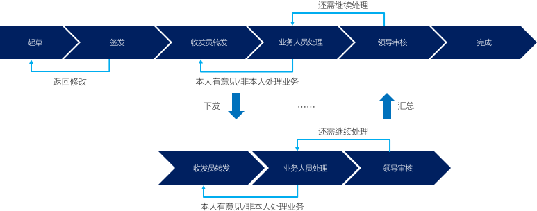

# 商业应用加速器（#Biz Apps Accelerator#）

基于Microsoft Power Platform的一系列应用加速器。

在企业中存在很多长尾应用，也可以认为都是些鸡肋应用，所谓立项嫌贵，不做又累。但正是这些看似渺小却又茫茫然遍布企业的业务需求，构成了传统数字化转型“最后一公里"涵待解决的问题。

服用低代码平台的药效之一，就是用来快速将这些日常沉没在Excel和SharePoint，甚至笔记本记事贴上的应用转变为真正数字化的“业务应用"。所谓的快速，如果不能在一周产出第一个可供用户使用的版本，那就是服用方式不对。当然，并非所有人都生而为“专家"，也不是所有人知道“低代码开发"与“开发"的区别。所以，这里的“商业应用加速器"的初衷就是希望可以给出一个示范，或者是一个参考，或者是一个起点。来帮助你快速的为你的客户将上周告诉你的一个想法变成一个看得到摸得着的应用。

# 关于作者

截至今时今日，我还是微软商务应用产品部门的一名产品解决方案专家，在行业浸淫数载，自认为走过的山路十八弯，对山里沟里的事事物物还是具备一些“略懂“的见解。擅长听君一席话，助君信息化。

# 如何使用这些项目

谁适合使用这些应用加速器？

* 如果你是合作伙伴，可以基于此构建更加垂直化的行业解决方案，或者减少第一期项目的服务费用，还利于“客户"；
* 如果你是客户，我鼓励你将其作为企业内部试行低代码平台的起步项目，希望可以帮助你省时省力，让你的第一个项目更容易。也希望可以因此帮助你开拓职场新机会；

# 注意事项

* 正确的期待 - 我知道很多人都期待一个拿来就用的东西。但如果真有这样的东西，那现在的IT行业应该早就秋风凋零没有任何应用或方法能100%满足你的需求，即使有，也只在特定时间时空。所以应用也是需要与业务共同成长的
* 修改不如重造 - 是否觉得改别人的东西似乎比自己从头造一个更花时间？不要怀疑，这样的事情在低代码平台时常发生

# 免责申明

所有这些项目均来自日常售前方案所归纳出来的常见场景。已经进行了脱敏脱毛处理，无行业特性，无客户机密，请随意取用。

# 绝世武功的……目录

这里列出了一些常见业务场景的列表，后续会逐渐更新，包括可供下载的Solution方案包以及相关演示材料。

千里之行始于足下，路还是要一步一步来。敬请耐心期待，同时也欢迎留言或提出建议。

## 基于状态机的可配置任务流转方案

说人话就是：任务流转方案。该方案因应中国所特有的任务流转机制而产生。其特点就是：任务下发、部门收发、汇总上报。

### 背景故事

集团公司发文给部门及下属分公司，下属公司收文并分派正确人员处理，期间可以选择转发其他部门或下属子公司。当所有审批完成后汇总上报上级公司。

### 方案特点

* 支持无限层级下发汇总上报
* 支持一人多岗

### 更新日志

## 资产领用、维护及管理解决方案

## 培训/活动注册管理
