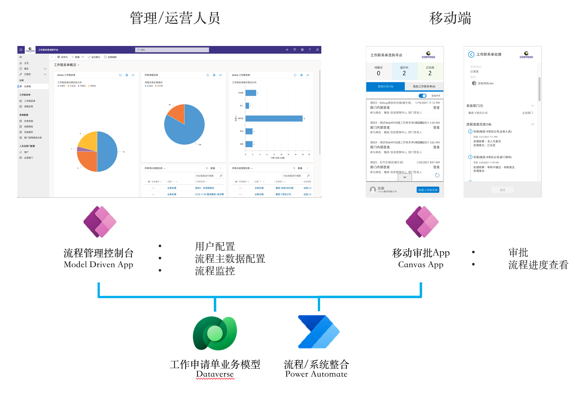
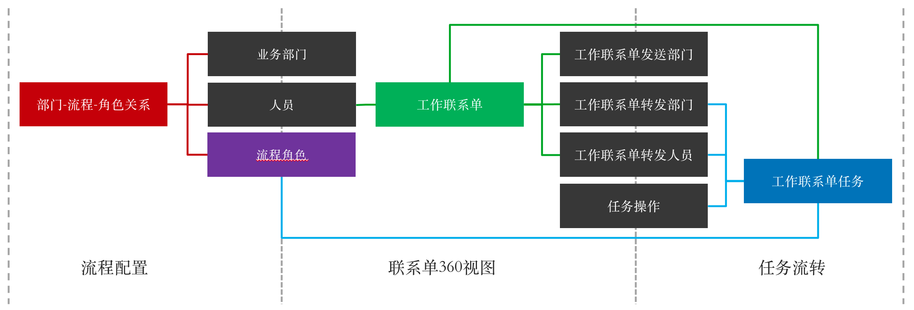
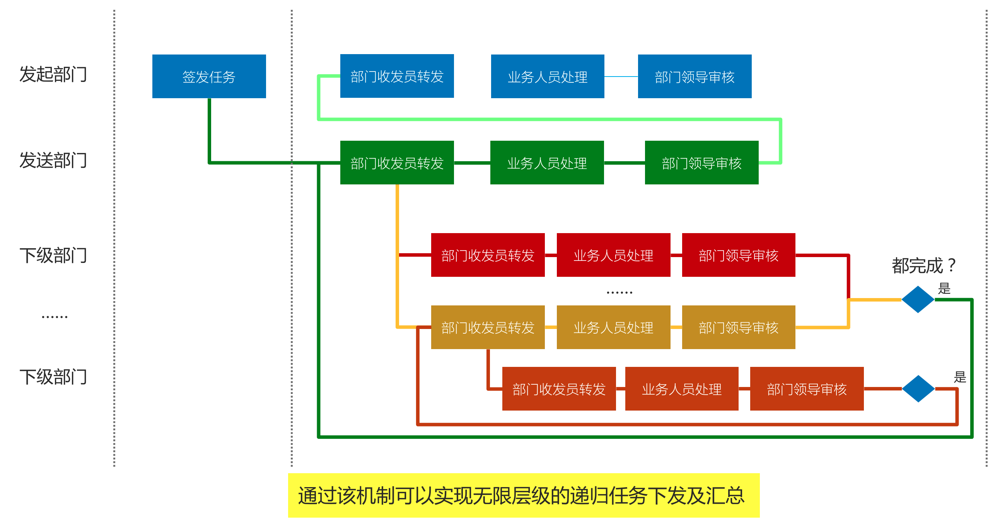
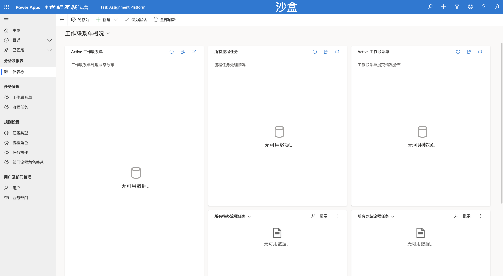
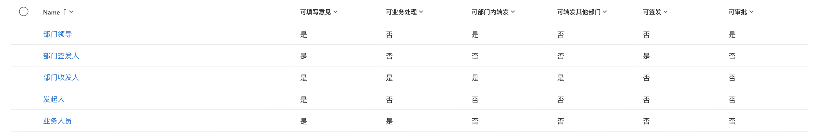
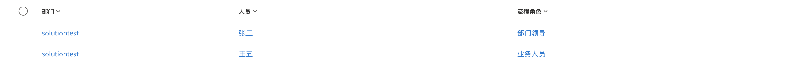
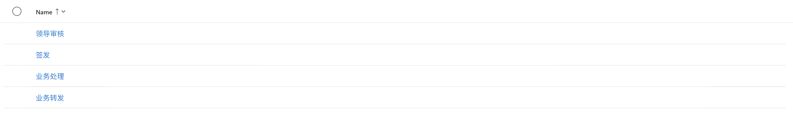
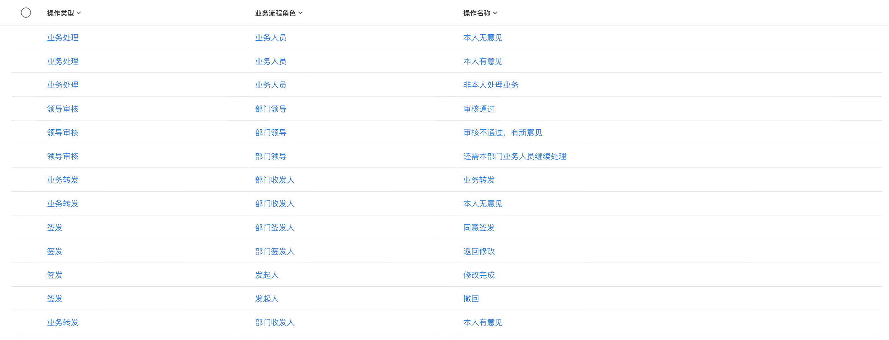
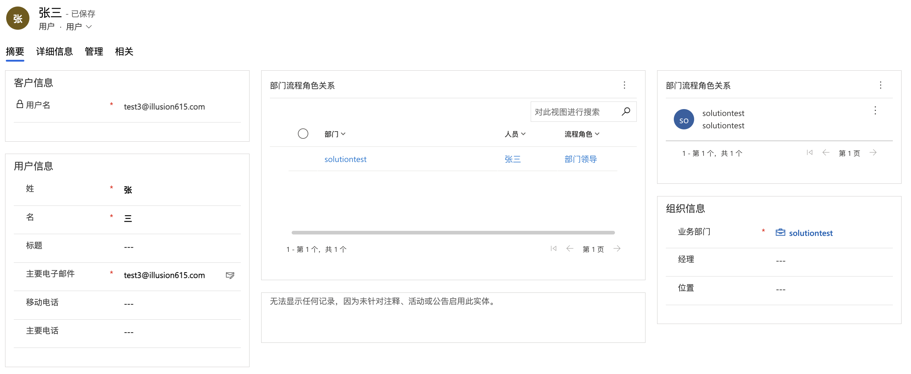

# 基于状态机的任务分发方案

# 方案依赖

## 产品许可

如果你具有如下许可之一，则都可以使用该方案

* 国际版或中国21v世纪互联版Microsoft Power Apps per User Plan或per App Plan
* 国际版或中国21v世纪互联版Microsoft Dynamics 365 Customer Engagement Apps

> 注意：因为该方案会使用到Dataverse以及Model Driven App，因此Office 365自带的Power Apps版本无法使用。

## 权限要求

你需要具备创建环境以及导入解决方案的权限。

* 创建环境的权限
* 导入解决方案

# 解决方案设计

## 架构

## 数据模型

模型的核心是两张表

### 工作联系单

表单类型：标准表

主要属性：

流程任务

| 类别           | 属性名称     | 属性含义                                                                                                                 |
| -------------- | ------------ | ------------------------------------------------------------------------------------------------------------------------ |
| 流程节点信息   | 上一级任务   | 如果该任务是由上级部门下发，则该字段记录上一级任务。                                                                     |
|                | 前序任务     | 记录该任务的前序任务。                                                                                                   |
|                | 任务类型     | 基于任务类型会判断处理人可操作的处理结果。                                                                               |
| 受理部门及人员 | 处理业务部门 | 该任务当前处理业务部门。                                                                                                 |
|                | 负责人       | 该任务当前负责人。                                                                                                       |
|                | 业务流程角色 | 该负责人在处理该任务时时的角色。因为人员可能承担不同角色，因此业务流程角色和部门的关联关系在“部门流程角色关系"表中配置。 |
| 节点处理结果   | 处理结果     | 根据任务类型和相关处理人所承担的角色，从“任务操作"中选择可用操作。                                                       |
|                | 部门人员转发 | 如果处理结果为“转发"，此处记录需要转发的目标人员。                                                                       |
|                | 转发其他部门 | 如果处理结果为“转发"，此处记录需要转发的目标部门。                                                                       |

## 流程逻辑

首先对流程逻辑进行分解，虽然层级关系看上去很复杂，但每个单元操作相对可归纳。每个任务上可执行的操作基于不同角色存在如下操作：

| 角色       | 操作         |
| ---------- | ------------ |
| 发起人     | 保存草稿     |
|            | 撤销         |
|            | 提交         |
| 审批人     | 审核通过     |
|            | 审核驳回     |
|            | 要求修改     |
|            | 需继续处理   |
| 部门收发员 | 转发办理员工 |
|            | 转发其他部门 |
|            | 提交审核     |
| 办理人     | 驳回         |
|            | 提交处理结果 |

# 安装及初始化

## 下载

请至release下载最新版本。所提供的版本为Unmanaged版本，便于大家后续根据自身实际情况进行修改。

## 安装

1. 将方案导入你的Power Platform环境。将开发环境和生产环境分开是一个好习惯，这样可以让你在后面进行方案修改的同时不会影响已经在使用的用户。
2. 基于你环境对base语言，可能需要对Model Driven Apps的Sitemap进行修改，发布后运行应该可以看到类似如下的界面
   
3. 打开方案中的flow，如果是第一次打开会需要配置数据源连接。确保所有flow的状态为打开状态。
4. 尝试运行Canvas App，如果无法正常运行，请进入编辑界面，根据具体错误信息进行调整。错误信息包括但不仅限于：数据连接需初始化。

> 有什么原因导致Canvas无法正常运行？
>
> * 由于Power Apps是一个迭代很快的平台，虽然一个应用系统很难在很长一段时间内都完全不更新，但的确有这种可能：一个导出到本地保存的解决方案在导入新环境后无法运行。这种情况下需要进入编辑模式，逐一修复提示的错误，并重新发布。
> * 企业IT可能会制定个性化的DLP（数据防丢失策略），而某些策略可能会阻止同时使用特定数据连接器。

## 设置

处于测试目的，你需要配置如下内容。

> 这部分内容会在后续进行优化以最小化设置所需的工作量。当然设计逻辑也会进行简化。

### 流程角色

### 部门流程角色关系

### 任务类型

### 任务操作

然后在用户中将可以看到与流程相关的信息，如下图：

# 使用说明

待更新

# 未来计划

* 改善流程配置，简化配置工作量
* 流程模版
* 可供外部调用的WebAPI
* 更加易用的流程可视化组件
